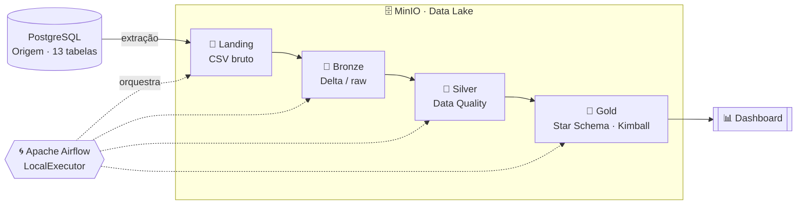

<div align="center">

# 🏆 Projeto Final — Engenharia de Dados
### Arquitetura Medalhão • Lakehouse Self-Hosted • Streaming Analytics


[](https://davinovakoskim-code.github.io/projeto-final-eng-dados/)

---

**🎓 SATC** — Associação Beneficente da Indústria Carbonífera de Santa Catarina  
**📘 Engenharia de Software** • 5ª Fase • **Engenharia de Dados**  
**🧑‍🏫 Professor:** Jorge Luiz Silva

</div>

---

## 🎯 Sobre o Projeto

Pipeline de dados **end-to-end** seguindo a **Arquitetura Medalhão** (Landing → Bronze → Silver → Gold),
com orquestração via **Apache Airflow**. O domínio modelado é o de uma **plataforma de streaming**
(estilo Twitch), com **13 tabelas** e ~110 mil registros sintéticos gerados com Faker.

> **💡 Diferencial:** infraestrutura **100% self-hosted via Docker** — PostgreSQL (origem),
> MinIO (data lake S3-compatível), PySpark + Delta Lake (processamento) e Apache Airflow
> (orquestração). Tudo sobe localmente com `docker compose`.

---

## 🏛️ Arquitetura do Pipeline



Todos os serviços (Postgres, MinIO, Airflow) se comunicam por uma **rede Docker compartilhada
`datalake`**, e o Airflow já possui *connections* configuradas para o Postgres e o MinIO.

---

## 🧰 Stack Tecnológica

| Tecnologia | Papel no Projeto |
|:--|:--|
| 🐘 **PostgreSQL 15** | Banco de dados de origem (Docker) |
| 🪣 **MinIO** | Data Lake S3-compatível (camadas landing/bronze/silver/gold) |
| ⚡ **Apache Spark 3.5** | Motor de processamento distribuído |
| 🔼 **Delta Lake 3.2** | Armazenamento ACID (Bronze, Silver, Gold) |
| 🌀 **Apache Airflow 2.9** | Orquestração do pipeline (LocalExecutor) |
| 🎲 **Faker** | Geração de dados sintéticos |
| 📦 **uv** | Gerenciador de dependências (Python 3.12) |
| 📖 **MkDocs Material** | Documentação técnica publicada |

---

## 🗄️ Domínio de Dados — Plataforma de Streaming

Banco relacional estilo Twitch com **13 tabelas**. Diagrama ER completo na
[documentação](https://davinovakoskim-code.github.io/projeto-final-eng-dados/origem/).

| # | Tabela | Papel |
|--:|:--|:--|
| 1 | `plataformas` | Plataformas de streaming |
| 2 | `jogos` | Jogos transmitidos |
| 3 | `streamers` | Criadores de conteúdo |
| 4 | `viewers` | Espectadores |
| 5 | `emotes` | Emotes por streamer |
| 6 | `transmissoes` | Lives realizadas |
| 7 | `visualizacoes` | Audiência por transmissão |
| 8 | `follows` | Relação de follow |
| 9 | `assinaturas` | Assinaturas (tiers) |
| 10 | `doacoes` | Doações em lives |
| 11 | `clips` | Clipes gerados |
| 12 | `raids` | Raids entre streamers |
| 13 | `moderadores` | Moderadores de canais |

---

## 🥉🥈🥇 Camadas do Lakehouse

### 🥉 LANDING — Dados Brutos
- **Formato:** CSV · **Origem:** PostgreSQL · **Destino:** bucket `landing` no MinIO
- Snapshot exato da fonte, sem transformação.

### 🥉 BRONZE — Ingestão em Delta Lake
- **Formato:** Delta Lake · **Bucket:** `bronze`
- Dados crus persistidos com transações ACID e Time Travel.

### 🥈 SILVER — Data Quality
- **Formato:** Delta Lake · **Bucket:** `silver`
- Deduplicação, remoção de nulos, padronização e validação de domínios.

### 🥇 GOLD — Modelagem Dimensional (Kimball)
- **Formato:** Delta Lake · **Bucket:** `gold`
- Tabelas de dimensão e fato (star schema) prontas para análise.

---

## 🚀 Como Rodar

### Pré-requisitos
[Docker](https://docs.docker.com/get-docker/) + Docker Compose · [uv](https://docs.astral.sh/uv/) · Git

### 1. Clonar e configurar
```bash
git clone https://github.com/davinovakoskim-code/projeto-final-eng-dados.git
cd projeto-final-eng-dados
cp .env.example .env   # preencha POSTGRES_*, DB_* e MINIO_*
```

> ⚠️ O `generate_data.py` lê as variáveis **`DB_*`**. No modo local, aponte
> `DB_HOST=localhost` e `DB_PORT=5433`.

### 2. Criar a rede compartilhada (uma vez)
```bash
docker network create datalake
```

### 3. Subir a infraestrutura
```bash
docker compose -f docker/postgres/docker-compose.yml up -d   # PostgreSQL (inicializa o schema)
docker compose -f docker/docker-compose.yml up -d            # MinIO + criação dos buckets
docker compose -f docker/airflow/docker-compose.yml up -d    # Airflow (UI: http://localhost:8080)
```

### 4. Dependências e geração de dados
```bash
uv sync
uv run python src/01_origem/generate_data.py
```

### 5. Documentação local
```bash
uv run mkdocs serve   # http://127.0.0.1:8000
```

---

## 📊 Status do Projeto

- [x] **Origem** — schema relacional (13 tabelas) + geração de dados (Faker)
- [x] **Infraestrutura** — PostgreSQL + MinIO + buckets + rede `datalake` (uv)
- [x] **Engine** — Spark + Delta Lake + MinIO (s3a)
- [x] **Airflow** — LocalExecutor + connections (Postgres + MinIO)
- [x] **Documentação** — MkDocs + Material (publicada)
- [ ] **Ingestão** — Landing → Bronze
- [ ] **Transformação** — Silver (Data Quality)
- [ ] **Gold** — modelagem dimensional (Kimball)
- [ ] **Orquestração** — DAG encadeando todas as etapas
- [ ] **Dashboard**

---

## 👥 Equipe

| Integrante | GitHub |
|:--|:--|
| Davi Novakoski | [@davinovakoskim-code](https://github.com/davinovakoskim-code) |
| Victor Casagrande | [@CasagrandeVictor](https://github.com/CasagrandeVictor) |
| Isabela Madeira José | [@isabelamadeirajose](https://github.com/isabelamadeirajose) |
| Isaac Alexsander | [@Isaac-Alexsander](https://github.com/Isaac-Alexsander) |

---

<div align="center">

📖 **[Documentação completa →](https://davinovakoskim-code.github.io/projeto-final-eng-dados/)**

*SATC • Engenharia de Software • Engenharia de Dados*

</div>
