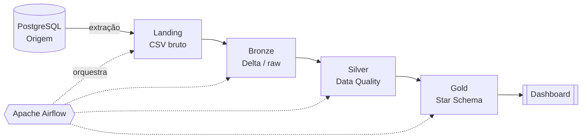

# Projeto Final — Engenharia de Dados

Pipeline de dados ponta a ponta implementando a **arquitetura Medalhão**
(Landing → Bronze → Silver → Gold) sobre um banco relacional estilo plataforma de
streaming (Twitch-like), com data lake em **MinIO**, processamento em **PySpark + Delta Lake**
e orquestração via **Apache Airflow**.

> Disciplina de Engenharia de Dados — Prof. Jorge Luiz Silva · SATC (Criciúma/SC).
> Complemento dos Trabalhos 1 e 2, em ambiente self-hosted.

## Visão geral

O projeto extrai todas as tabelas de um PostgreSQL de origem e as faz percorrer as camadas
da arquitetura Medalhão, em qualidade crescente, até estarem prontas para análise:



| Camada | Conteúdo | Formato |
|---|---|---|
| **Landing** | Dados brutos extraídos da origem | CSV |
| **Bronze** | Dados crus persistidos no lake | Delta Lake |
| **Silver** | Dados validados e limpos (Data Quality) | Delta Lake |
| **Gold** | Tabelas dimensionais/fatos (Ralph Kimball) | Delta Lake |

## Stack

| Função | Tecnologia |
|---|---|
| Banco de origem | PostgreSQL 15 |
| Data Lake | MinIO (S3-compatível) |
| Processamento | PySpark 3.5 + Delta Lake 3.2 |
| Orquestração | Apache Airflow |
| Geração de dados | Faker |
| Dependências | uv (Python 3.12) |
| Documentação | MkDocs + Material |

## Estrutura do projeto

```
projeto-final-eng-dados/
├── docker/
│   ├── docker-compose.yml            # serviço MinIO
│   └── postgres/docker-compose.yml   # PostgreSQL (inicializa schema.sql)
├── docs/                             # documentação (MkDocs)
├── src/
│   ├── 01_origem/                    # schema.sql + generate_data.py (Faker)
│   ├── 02_ingestao/                  # extração → Landing/Bronze
│   ├── 03_transformacao/             # Silver (Data Quality)
│   ├── 04_modelagem_gold/            # Gold (modelagem Kimball)
│   ├── 05_orquestracao/              # DAG do Airflow
│   └── 06_dashboard/                 # visualização
├── scripts/
├── tests/
├── mkdocs.yml
├── pyproject.toml
└── uv.lock
```

## Como rodar

### Pré-requisitos

- [Docker](https://docs.docker.com/get-docker/) + Docker Compose
- [uv](https://docs.astral.sh/uv/) (gerencia o Python 3.12 e as dependências)
- Git

### 1. Clonar e configurar o ambiente

```bash
git clone https://github.com/davinovakoskim-code/projeto-final-eng-dados.git
cd projeto-final-eng-dados
cp .env.example .env
```

Edite o `.env`. Para rodar **tudo localmente** (Postgres no Docker), use este conjunto:

```dotenv
# PostgreSQL local (usado pelo docker-compose)
POSTGRES_USER=admin
POSTGRES_PASSWORD=admin
POSTGRES_DB=origem

# Conexão usada pelo generate_data.py (aponta para o container local)
DB_HOST=localhost
DB_PORT=5433
DB_NAME=origem
DB_USER=admin
DB_PASSWORD=admin

# MinIO
MINIO_ROOT_USER=minioadmin
MINIO_ROOT_PASSWORD=troque_aqui
```

> ⚠️ **Atenção:** o `generate_data.py` lê as variáveis **`DB_*`** (não as `POSTGRES_*`).
> Por isso, no modo local, aponte `DB_HOST=localhost` e `DB_PORT=5433` (a porta exposta
> pelo container). Alternativamente, é possível usar um PostgreSQL na nuvem (ex.: Supabase)
> preenchendo apenas o bloco `DB_*`.

### 2. Subir a infraestrutura
Antes de subir os serviços, crie a rede Docker compartilhada (apenas uma vez):
```bash
docker network create datalake
```

Essa rede permite que os containers (Postgres, MinIO e, futuramente, Airflow) se comuniquem entre si.
```bash
# PostgreSQL de origem (cria o schema automaticamente a partir de src/01_origem/schema.sql)
docker compose -f docker/postgres/docker-compose.yml up -d

# MinIO (console web em http://localhost:9001)
docker compose -f docker/docker-compose.yml up -d
```
> Ao subir, o MinIO cria automaticamente os buckets das camadas da arquitetura Medalhão: `landing`, `bronze`, `silver` e `gold` (via container `createbuckets`, que roda após o MinIO ficar disponível e encerra em seguida). O console web fica em http://localhost:9001 (login com as credenciais do `.env`).


### 3. Instalar dependências e gerar os dados

```bash
uv sync
uv run python src/01_origem/generate_data.py
```

Isso popula o banco de origem com ~110 mil registros sintéticos (Faker).

### 4. Etapas do pipeline

As camadas de ingestão, transformação, gold e orquestração estão em desenvolvimento
(ver *Status* abaixo). Cada etapa será executada a partir de `src/` e, ao final,
encadeada por uma DAG do Airflow.

## Documentação

A documentação técnica completa é gerada com MkDocs:

```bash
uv sync --group docs
uv run mkdocs serve     # http://127.0.0.1:8000
```

> Site publicado: _a definir após o `mkdocs gh-deploy`._

## Status do pipeline

- [x] Origem — schema relacional (13 tabelas) + geração de dados (Faker)
- [x] Infraestrutura — PostgreSQL + MinIO via Docker Compose, gestão com uv
- [x] Documentação — MkDocs + Material (estrutura inicial)
- [ ] Ingestão — Landing → Bronze
- [ ] Transformação — Silver (Data Quality)
- [ ] Gold — modelagem dimensional (Kimball)
- [ ] Orquestração — DAG do Airflow
- [ ] Dashboard

## Equipe

- [@davinovakoskim-code](https://github.com/davinovakoskim-code)
- [@CasagrandeVictor](https://github.com/CasagrandeVictor)
- [@isabelamadeirajose](https://github.com/isabelamadeirajose)
- [@Isaac-Alexsander](https://github.com/Isaac-Alexsander)

## Referências

Arquitetura Medalhão, Delta Lake, modelagem Kimball, MinIO, Airflow e os repositórios-base
da disciplina estão reunidos na [página de Referências](docs/referencias.md) da documentação.
