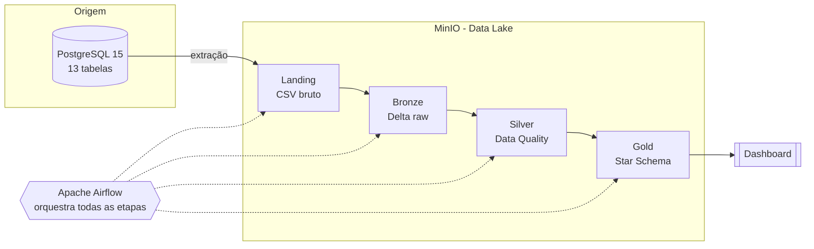

# Arquitetura

O projeto segue a **arquitetura Medalhão**, onde os dados avançam por camadas de
qualidade crescente até estarem prontos para análise.

## Visão geral do fluxo

## Camadas (Medalhão)

| Camada | Conteúdo | Formato |
|---|---|---|
| **Landing** | Dados brutos extraídos da origem, sem transformação | CSV |
| **Bronze** | Mesmos dados, persistidos no lake | Delta Lake |
| **Silver** | Dados validados e limpos (Data Quality) | Delta Lake |
| **Gold** | Tabelas dimensionais e fatos (Kimball) para análise | Delta Lake |

## Infraestrutura (Docker Compose)

O ambiente sobe localmente com os seguintes serviços:

| Serviço | Imagem | Portas | Observação |
|---|---|---|---|
| `postgres_origem` | postgres:15 | `5433:5432` | Inicializa o `schema.sql` automaticamente |
| `minio` | minio/minio | `9000` (API), `9001` (console) | Data lake S3-compatível |
| `airflow` | apache/airflow:2.9 | `8080` | Orquestração do pipeline (LocalExecutor) |
| `metabase` | metabase/metabase | `3000` | Dashboard (One Page View) |

## Diagrama Entidade-Relacionamento

O modelo relacional completo da origem está em [Origem](origem.md#modelo-entidade-relacionamento).
