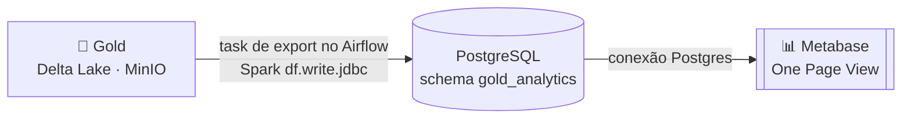

# Dashboard

Camada de consumo: visualização dos KPIs e métricas a partir das tabelas da
camada **Gold**, no padrão **One Page View**.

## Ferramenta escolhida: Metabase

A ferramenta de dataviz do projeto é o **[Metabase](https://www.metabase.com/)**
(open-source, self-hosted via Docker).

### Por que Metabase

- **Combina com o stack atual** — o projeto já é 100% Docker (PostgreSQL, MinIO,
  Airflow). O Metabase entra como mais um serviço no `docker compose`, sem
  tecnologia de infra nova.
- **Lê a Gold por uma camada relacional virtualizada** — o enunciado permite que
  o dashboard consuma a Gold *"de um banco de dados relacional que possui os dados
  virtualizados da camada gold"*. É exatamente o caminho adotado (ver abaixo).
- **Rápido de montar** — conexão a Postgres em poucos cliques; KPIs viram *cards*
  e as métricas viram gráficos, montados no editor visual. O *One Page View* é um
  dashboard com os cards organizados em uma única tela.
- **Demonstração de carga incremental** — ao rodar a DAG durante a apresentação, o
  dado flui até o Postgres de consumo e o dashboard reflete a atualização.

### Alternativas avaliadas

| Ferramenta | Caminho de leitura da Gold | Por que não foi escolhida |
|---|---|---|
| **Power BI Desktop** | Importar CSV/Parquet exportado da Gold | Fora do Docker (só Windows); `.pbix` versiona mal no Git; demo de incremental menos fluida. |
| **Superset + Trino** | Lê o Delta no MinIO **direto** (sem cópia) | Dois serviços pesados + catálogo Delta para configurar; setup arriscado para o prazo. |

## Como o Metabase lê a Gold

A camada Gold está em **Delta Lake no MinIO (S3)**, formato que o Metabase não lê
nativamente. O consumo é feito por uma **camada relacional virtualizada**: os
*marts* agregados da Gold são materializados em um schema `gold_analytics` no
**Postgres** já existente, e o Metabase consulta esse schema via SQL.



- **Origem dos dados do dashboard:** os *marts* agregados produzidos por
  [`src/04_modelagem_gold/gold_agregados.py`](https://github.com/davinovakoskim-code/projeto-final-eng-dados/blob/main/src/04_modelagem_gold/gold_agregados.py)
  (`agg_streamer_visao_geral`, `agg_receita_mensal`, `agg_jogo_popularidade`,
  `agg_plataforma_resumo`), além das tabelas fato/dimensão quando necessário.
- **Materialização:** uma task no pipeline lê os marts da Gold (Delta) e grava no
  schema `gold_analytics` do Postgres via `df.write.jdbc(...)` (overwrite).
- **Conexão do Metabase:** aponta para o Postgres (host/porta/credenciais do
  `.env`), schema `gold_analytics`.

!!! note "Validação do critério (#28)"
    A leitura da Gold pelo Metabase **via Postgres virtualizado** é o caminho
    validado: não depende de conector Delta/S3 no Metabase — apenas de uma
    conexão Postgres padrão, que o Metabase suporta nativamente.

## KPIs e métricas (One Page View)

Os 4 KPIs do dashboard batem com os marts exportados para `gold_analytics`. As queries
completas estão em [`src/06_dashboard/kpis_queries.sql`](../src/06_dashboard/kpis_queries.sql).

### KPI 1 — Receita Total

Soma de doações + assinaturas de todo o período, com comparação % vs. mês anterior.

- **Fonte:** `gold_analytics.agg_receita_mensal`
- **Coluna:** `receita_total` (= `receita_doacoes` + `receita_assinaturas`)
- **Card Metabase:** *Metric* → `SUM(receita_total)` → ativar "Compare to previous period"

```sql
SELECT ROUND(SUM(receita_total), 2) AS receita_total_global
FROM gold_analytics.agg_receita_mensal;
```

### KPI 2 — Valor Médio por Doação

Receita de doações dividida pelo número de doações (ticket médio das doações).

- **Fonte:** `gold_analytics.agg_receita_mensal`
- **Colunas:** `receita_doacoes`, `qtd_doacoes`
- **Card Metabase:** *Native query* com a SQL abaixo → exibir como número

```sql
SELECT
    ROUND(
        SUM(receita_doacoes) / NULLIF(SUM(qtd_doacoes), 0),
        2
    ) AS valor_medio_por_doacao
FROM gold_analytics.agg_receita_mensal
WHERE qtd_doacoes > 0;
```

### KPI 3 — Número de Transmissões

Contagem total de transmissões em todo o período.

- **Fonte:** `gold_analytics.agg_streamer_visao_geral`
- **Coluna:** `qtd_transmissoes`
- **Card Metabase:** *Metric* → `SUM(qtd_transmissoes)` → pode usar "Compare to previous period"

```sql
SELECT SUM(qtd_transmissoes) AS total_transmissoes
FROM gold_analytics.agg_streamer_visao_geral;
```

Para gráfico de tendência (top streamers por transmissões):

```sql
SELECT nome_streamer, nome_plataforma, qtd_transmissoes, horas_transmitidas
FROM gold_analytics.agg_streamer_visao_geral
WHERE qtd_transmissoes > 0
ORDER BY qtd_transmissoes DESC
LIMIT 10;
```

### KPI 4 — Viewers Ativos

Contagem de viewers únicos com visualização registrada no período.

- **Fonte:** `gold_analytics.agg_streamer_visao_geral`
- **Coluna:** `viewers_unicos`
- **Card Metabase:** *Metric* → `SUM(viewers_unicos)`

```sql
SELECT SUM(viewers_unicos) AS viewers_ativos_total
FROM gold_analytics.agg_streamer_visao_geral
WHERE viewers_unicos > 0;
```

**Métricas (gráficos — issues #34):**

1. **Receita por plataforma** — barras por `nome_plataforma` (`agg_plataforma_resumo.total_doacoes + mrr`).
2. **Top jogos por transmissões** — barras horizontais (`agg_jogo_popularidade.qtd_transmissoes`).

As consultas adicionais estão em
[`src/04_modelagem_gold/consultas_analiticas.sql`](../src/04_modelagem_gold/consultas_analiticas.sql).

## Código

### Serviço Metabase (`docker/docker-compose.yml`)

O Metabase sobe na rede `datalake` junto com MinIO e Jupyter.
Acesso: `http://localhost:3000`.

```yaml
metabase:
  image: metabase/metabase:latest
  container_name: metabase
  ports:
    - "3000:3000"
  environment:
    MB_DB_TYPE: postgres
    MB_DB_DBNAME: metabase
    MB_DB_HOST: postgres_origem
    MB_DB_USER: ${POSTGRES_USER}
    MB_DB_PASS: ${POSTGRES_PASSWORD}
  networks:
    - datalake
```

O database `metabase` é criado automaticamente pelo script
`docker/postgres/init_extra_dbs.sql` na inicialização do `postgres_origem`.

### Export Gold → Postgres (`src/06_dashboard/gold_to_postgres.py`)

Lê cada mart da Gold (Delta/MinIO) e grava via JDBC no schema `gold_analytics`
do Postgres existente. Modo `overwrite` + `truncate=true` garante idempotência.

```python
df.write
  .format("jdbc")
  .option("url", "jdbc:postgresql://postgres_origem:5432/origem")
  .option("dbtable", "gold_analytics.agg_receita_mensal")
  .option("user", ...)
  .option("password", ...)
  .option("driver", "org.postgresql.Driver")
  .option("truncate", "true")
  .mode("overwrite")
  .save()
```

### DAG completa (`src/05_orquestracao/pipeline_medallion_dag.py`)

O pipeline encadeia todas as etapas:

```
inicio → landing → bronze → silver → gold_star → gold_marts → gold_to_postgres → fim
```

### Como subir o Metabase

```bash
# 1. (Re)criar o postgres_origem com o database metabase criado
docker compose -f docker/postgres/docker-compose.yml up -d

# 2. Subir MinIO + Metabase
docker compose -f docker/docker-compose.yml up -d metabase

# 3. Acessar e configurar
#    http://localhost:3000 → Setup → Add database → PostgreSQL
#    Host: postgres_origem | Port: 5432 | Database: origem
#    Schema: gold_analytics | User/Password: conforme .env
```

### Validar a conexão

Após rodar a DAG completa, o schema `gold_analytics` terá 4 tabelas.
No Metabase, em *Browse data → gold_analytics*, os marts devem aparecer
com linhas prontas para construir os cards e gráficos (issues #30 e #34).
