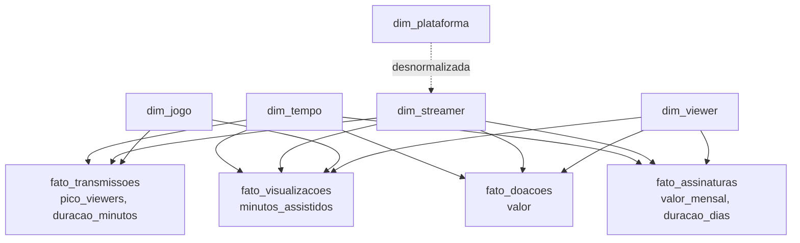

# Gold — Modelagem Dimensional (Kimball)

Lê os dados de **Silver** e materializa o **modelo estrela** (Ralph Kimball) na
camada Gold, em **Delta Lake** (`s3a://gold/<dim_ou_fato>/`).

Implementado em [`src/04_modelagem_gold/silver_to_gold.py`](https://github.com).
Consultas de exemplo em `src/04_modelagem_gold/consultas_analiticas.sql` e o
notebook `notebooks/silver_to_gold.ipynb`.

## Star Schema



## Dimensões

| Dimensão | Chave substituta | Chave natural | Atributos |
|---|---|---|---|
| `dim_tempo` | `sk_tempo` (`yyyyMMdd`) | `data` | ano, trimestre, mes, dia, dia_semana, nome_mes, fim_de_semana |
| `dim_plataforma` | `sk_plataforma` | `id_plataforma` | nome_plataforma |
| `dim_streamer` | `sk_streamer` | `id_streamer` | nome_streamer, pais, data_cadastro, plataforma (desnormalizada) |
| `dim_viewer` | `sk_viewer` | `id_viewer` | nome_viewer, pais, data_cadastro |
| `dim_jogo` | `sk_jogo` | `id_jogo` | nome_jogo, desenvolvedor, ano_lancamento, ativo |

## Fatos

| Fato | Grão | Métricas | Dimensões |
|---|---|---|---|
| `fato_transmissoes` | 1 transmissão | pico_viewers, duracao_minutos | tempo, streamer, jogo |
| `fato_visualizacoes` | 1 visualização | minutos_assistidos | tempo, viewer, streamer, jogo |
| `fato_doacoes` | 1 doação | valor | tempo, viewer, streamer |
| `fato_assinaturas` | 1 assinatura | valor_mensal, duracao_dias, ativa | tempo, viewer, streamer |

## KPIs e métricas

O modelo sustenta os **4 KPIs** e as **2 métricas** planejados para o dashboard.
Cada um é rastreável até o(s) fato(s) e dimensões que o calculam:

| # | KPI / Métrica | Definição | Cálculo | Fato × Dimensões | Mart |
|---|---|---|---|---|---|
| KPI 1 | Receita total por streamer | Soma de doações + assinaturas por streamer/período | `SUM(valor)` + `SUM(valor_mensal)` | `fato_doacoes` ∪ `fato_assinaturas` × `dim_streamer` × `dim_tempo` | `agg_streamer_visao_geral`, `agg_receita_mensal` |
| KPI 2 | Horas assistidas (watch time) | Soma de minutos assistidos ÷ 60 por jogo/período | `SUM(minutos_assistidos)/60` | `fato_visualizacoes` × `dim_jogo` × `dim_tempo` | `agg_jogo_popularidade` |
| KPI 3 | Pico médio de espectadores por jogo | Média do pico de viewers das transmissões por jogo | `AVG(pico_viewers)` | `fato_transmissoes` × `dim_jogo` | `agg_jogo_popularidade` |
| KPI 4 | Viewers únicos por streamer | Contagem distinta de viewers por streamer/período | `COUNT(DISTINCT sk_viewer)` | `fato_visualizacoes` × `dim_streamer` × `dim_tempo` | `agg_streamer_visao_geral` |
| Métrica 1 | Ticket médio da doação | Valor médio por doação | `AVG(valor)` | `fato_doacoes` | `agg_receita_mensal` |
| Métrica 2 | Duração média das transmissões | Média da duração das lives | `AVG(duracao_minutos)` | `fato_transmissoes` × `dim_tempo` | `agg_streamer_visao_geral` |

> **Nota:** conjunto de KPIs/métricas a confirmar com o professor. Cada item já tem
> um fato no grão adequado e dimensões para fatiar (por tempo, streamer ou jogo),
> e está pré-calculado nos data marts da seção abaixo.

## Princípios aplicados

- **Chaves substitutas** geradas na Gold; `dim_tempo` usa *smart key* `yyyyMMdd`.
- **Integridade referencial** validada aqui (joins fato × dimensão). Cada dimensão
  tem um **membro desconhecido** (`sk = -1`) para onde apontam fatos sem dimensão
  correspondente — nada é descartado silenciosamente.
- **Dimensões degeneradas**: os `id_*` da transação ficam no próprio fato.
- **Reprodutível**: gravação `overwrite`, reexecução reconstrói a Gold a partir da Silver.

## Agregados (data marts)

A Gold tem dois estágios. Depois do star schema, `gold_agregados.py` materializa
**tabelas agregadas** (`s3a://gold/agg_*`) — os joins fato × dimensão e as agregações
do modelo já resolvidos, prontos para o dashboard ler sem refazer `group by`:

| Mart | Grão | Conteúdo |
|---|---|---|
| `agg_streamer_visao_geral` | streamer | transmissões, audiência, doações e assinaturas consolidadas |
| `agg_receita_mensal` | mês | receita de doações + assinaturas (série temporal) |
| `agg_jogo_popularidade` | jogo | transmissões, streamers distintos, audiência |
| `agg_plataforma_resumo` | plataforma | streamers, doações, audiência |

## Uso

```bash
# 1) Star schema (dimensoes + fatos)
python src/04_modelagem_gold/silver_to_gold.py

# 2) Agregados (le o star schema e grava os marts)
python src/04_modelagem_gold/gold_agregados.py
```

Detalhes e variáveis de ambiente em `src/04_modelagem_gold/README.md`.
