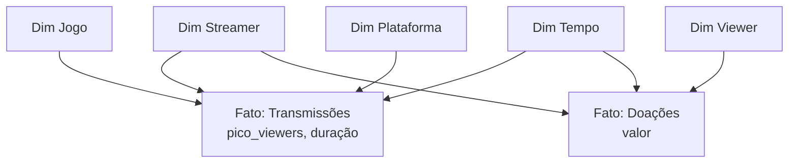

# Gold — Modelagem Dimensional (Kimball)

Lê os dados de **Silver** e alimenta o **modelo estrela** (Ralph Kimball) na camada Gold.

!!! warning "A iniciar"
    Etapa ainda não começada (sem PR associado).

## Esboço do Star Schema

Proposta inicial de dimensões e fatos a partir do domínio de streaming:

## Dimensões e fatos previstos

- **Dimensões:** `dim_streamer`, `dim_viewer`, `dim_jogo`, `dim_plataforma`, `dim_tempo`.
- **Fatos:** `fato_transmissoes`, `fato_doacoes`, `fato_assinaturas` (a confirmar).

## Código

A preencher com snippets de `src/04_modelagem_gold/` após implementação.
