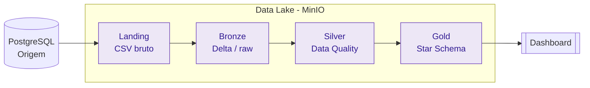

# Projeto Final — Engenharia de Dados

Pipeline de dados implementando a **arquitetura Medalhão** (Landing → Bronze → Silver → Gold)
sobre um banco relacional estilo **plataforma de streaming (Twitch-like)**, com orquestração
via Apache Airflow e data lake em MinIO.

!!! info "Disciplina"
    Engenharia de Dados — Prof. Jorge Luiz Silva · SATC (Criciúma/SC).
    Complemento dos Trabalhos 1 e 2; arquitetura Medalhão em ambiente self-hosted.

## Objetivo

Construir um pipeline ponta a ponta que:

1. **Extrai** todas as tabelas do banco de origem (PostgreSQL) para a camada **Landing** (CSV bruto).
2. Grava os dados em **Bronze** (formato Delta, dado cru).
3. Aplica **Data Quality** e grava em **Silver** (dado tratado e confiável).
4. Modela tabelas dimensionais (**Ralph Kimball**) na camada **Gold**.
5. Orquestra todas as etapas em sequência via **Airflow** (sem cron do SO).

## Stack

| Camada / Função | Tecnologia |
|---|---|
| Banco de origem | PostgreSQL 15 (Docker) |
| Data Lake | MinIO (S3-compatível) |
| Processamento | PySpark + Delta Lake |
| Orquestração | Apache Airflow |
| Geração de dados | Faker |
| Gerenciador de dependências | uv |
| Documentação | MkDocs + Material |

## Progresso da documentação

> Esta documentação é consolidada por uma pessoa (orquestração + docs) à medida que cada
> etapa do pipeline é finalizada pelos responsáveis. Status de cada seção:

| Seção | Fonte (issue/PR) | Status |
|---|---|---|
| Origem | #38 (schema), #39 (Faker), #40 (compose) — **mergeados** | ✅ Pronta para documentar |
| Arquitetura / Infra | #53 (uv), #49/#74 (MinIO) | 🟡 Em consolidação |
| Ingestão (Landing/Bronze) | #48 (em revisão), #42–#47 | ⏳ Aguardando merge |
| Transformação (Silver) | a iniciar | ⏳ Aguardando |
| Gold (Kimball) | a iniciar | ⏳ Aguardando |
| Dashboard | a iniciar | ⏳ Aguardando |

_Issues de documentação: **#31** (setup MkDocs) e **#32** (README + deploy)._
