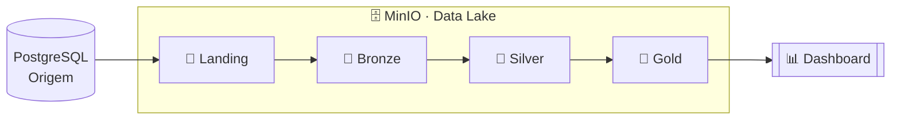

# 🏆 Projeto Final — Engenharia de Dados

### Arquitetura Medalhão • Lakehouse Self-Hosted • Streaming Analytics

!!! info "Disciplina"
    **Engenharia de Dados** — Prof. Jorge Luiz Silva · **SATC** (Criciúma/SC) · 5ª Fase de Eng. de Software.

Pipeline de dados **end-to-end** com **arquitetura Medalhão** (Landing → Bronze → Silver → Gold)
sobre um banco relacional estilo **plataforma de streaming (Twitch-like)**, com data lake em
**MinIO**, processamento em **PySpark + Delta Lake** e orquestração via **Apache Airflow** —
tudo **self-hosted** com Docker.

## 🎯 Objetivo

1. **Extrair** todas as tabelas da origem (PostgreSQL) para a camada **Landing** (CSV).
2. Gravar em **Bronze** (Delta, dado cru).
3. Aplicar **Data Quality** e gravar em **Silver**.
4. Modelar tabelas dimensionais (**Ralph Kimball**) na camada **Gold**.
5. **Orquestrar** todas as etapas em sequência via **Airflow** (sem cron do SO).

## 🧰 Stack

| Camada / Função | Tecnologia |
|:--|:--|
| Banco de origem | PostgreSQL 15 (Docker) |
| Data Lake | MinIO (S3-compatível) |
| Processamento | PySpark + Delta Lake |
| Orquestração | Apache Airflow (LocalExecutor) |
| Dependências | uv (Python 3.12) |
| Documentação | MkDocs + Material |
| Dashboard | Metabase (self-hosted via Docker) |

## 📊 Progresso

- [x] **Origem** — schema (13 tabelas) + geração de dados (Faker)
- [x] **Infraestrutura** — PostgreSQL + MinIO + buckets + rede `datalake`
- [x] **Engine** — Spark + Delta Lake + MinIO (s3a)
- [x] **Airflow** — LocalExecutor + connections (Postgres + MinIO)
- [x] **Documentação** — MkDocs + README
- [x] **Ingestão** — Landing → Bronze
- [x] **Transformação** — Silver (Data Quality)
- [x] **Gold** — modelagem dimensional (Kimball)
- [x] **Orquestração** — DAG encadeando as etapas
- [x] **Dashboard** — Metabase (One Page View)

!!! tip "Navegue pela documentação"
    Use as abas no topo: **Arquitetura**, **Camadas do Pipeline** (Origem, Ingestão,
    Transformação, Gold), **Dashboard** e **Referências**.
