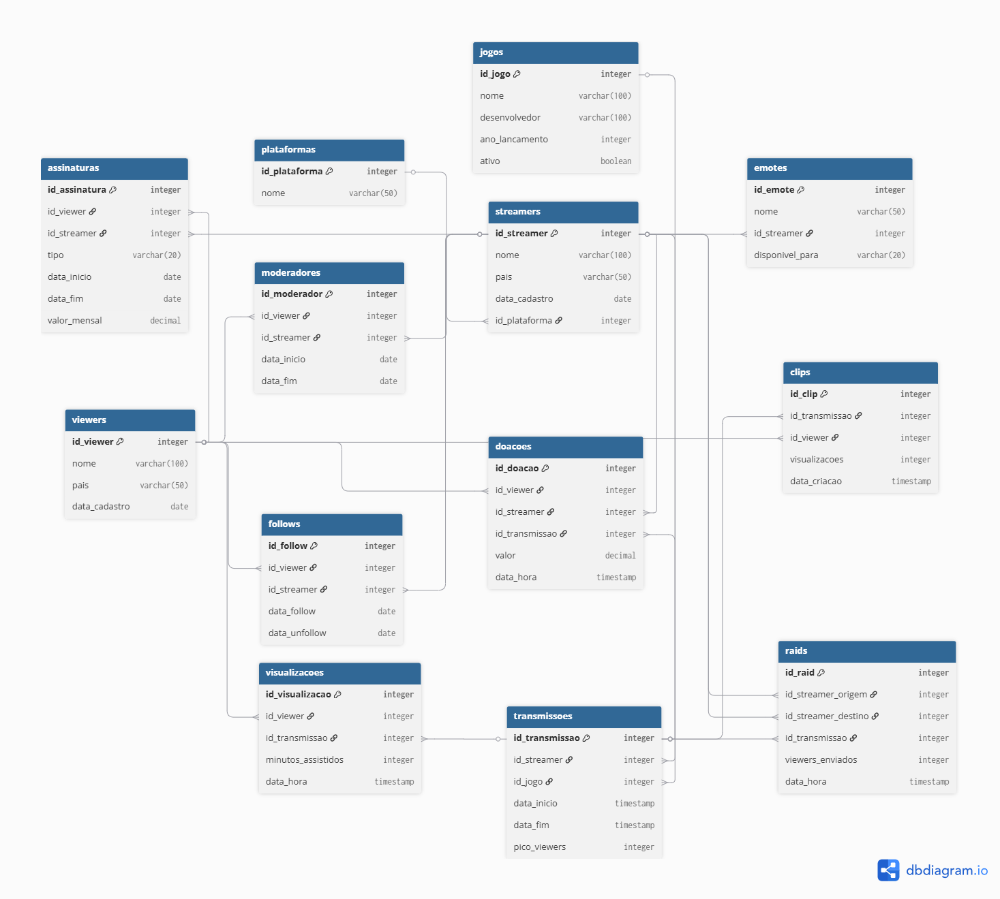

# Origem — Banco Relacional

A fonte de dados é um banco **PostgreSQL** que modela uma plataforma de streaming
(estilo Twitch), com **13 tabelas** e cerca de **110 mil registros** gerados com Faker.

## Modelo Entidade-Relacionamento

=== "Diagrama (Mermaid)"

    ```mermaid
    erDiagram
        PLATAFORMAS ||--o{ STREAMERS : hospeda
        JOGOS ||--o{ TRANSMISSOES : "jogado em"
        STREAMERS ||--o{ EMOTES : cria
        STREAMERS ||--o{ TRANSMISSOES : realiza
        STREAMERS ||--o{ FOLLOWS : recebe
        STREAMERS ||--o{ ASSINATURAS : tem
        STREAMERS ||--o{ DOACOES : recebe
        STREAMERS ||--o{ MODERADORES : possui
        STREAMERS ||--o{ RAIDS : "envia/recebe"
        VIEWERS ||--o{ VISUALIZACOES : gera
        VIEWERS ||--o{ FOLLOWS : faz
        VIEWERS ||--o{ ASSINATURAS : assina
        VIEWERS ||--o{ DOACOES : faz
        VIEWERS ||--o{ CLIPS : cria
        VIEWERS ||--o{ MODERADORES : "atua como"
        TRANSMISSOES ||--o{ VISUALIZACOES : tem
        TRANSMISSOES ||--o{ DOACOES : recebe
        TRANSMISSOES ||--o{ CLIPS : origina
        TRANSMISSOES ||--o{ RAIDS : "contexto de"

        PLATAFORMAS {
            int id_plataforma PK
            string nome
        }
        JOGOS {
            int id_jogo PK
            string nome
            string desenvolvedor
            int ano_lancamento
            bool ativo
        }
        STREAMERS {
            int id_streamer PK
            string nome
            string pais
            date data_cadastro
            int id_plataforma FK
        }
        VIEWERS {
            int id_viewer PK
            string nome
            string pais
            date data_cadastro
        }
        EMOTES {
            int id_emote PK
            string nome
            int id_streamer FK
            string disponivel_para
        }
        TRANSMISSOES {
            int id_transmissao PK
            int id_streamer FK
            int id_jogo FK
            timestamp data_inicio
            timestamp data_fim
            int pico_viewers
        }
        VISUALIZACOES {
            int id_visualizacao PK
            int id_viewer FK
            int id_transmissao FK
            int minutos_assistidos
            timestamp data_hora
        }
        FOLLOWS {
            int id_follow PK
            int id_viewer FK
            int id_streamer FK
            date data_follow
            date data_unfollow
        }
        ASSINATURAS {
            int id_assinatura PK
            int id_viewer FK
            int id_streamer FK
            string tipo
            date data_inicio
            date data_fim
            numeric valor_mensal
        }
        DOACOES {
            int id_doacao PK
            int id_viewer FK
            int id_streamer FK
            int id_transmissao FK
            numeric valor
            timestamp data_hora
        }
        CLIPS {
            int id_clip PK
            int id_transmissao FK
            int id_viewer FK
            int visualizacoes
            timestamp data_criacao
        }
        RAIDS {
            int id_raid PK
            int id_streamer_origem FK
            int id_streamer_destino FK
            int id_transmissao FK
            int viewers_enviados
            timestamp data_hora
        }
        MODERADORES {
            int id_moderador PK
            int id_viewer FK
            int id_streamer FK
            date data_inicio
            date data_fim
        }
    ```

=== "Imagem (PNG)"

    

## Tabelas

| # | Tabela | Papel | Chaves estrangeiras |
|--:|---|---|---|
| 1 | `plataformas` | Referência: plataformas de streaming | — |
| 2 | `jogos` | Referência: jogos transmitidos | — |
| 3 | `streamers` | Entidade: criadores de conteúdo | `plataformas` |
| 4 | `viewers` | Entidade: espectadores | — |
| 5 | `emotes` | Emotes de cada streamer | `streamers` |
| 6 | `transmissoes` | Lives realizadas | `streamers`, `jogos` |
| 7 | `visualizacoes` | Audiência por transmissão | `viewers`, `transmissoes` |
| 8 | `follows` | Relação de follow | `viewers`, `streamers` |
| 9 | `assinaturas` | Assinaturas (tiers) | `viewers`, `streamers` |
| 10 | `doacoes` | Doações em lives | `viewers`, `streamers`, `transmissoes` |
| 11 | `clips` | Clipes gerados | `transmissoes`, `viewers` |
| 12 | `raids` | Raids entre streamers | `streamers` (x2), `transmissoes` |
| 13 | `moderadores` | Moderadores de canais | `viewers`, `streamers` |

## Volumes gerados (Faker)

| Entidade | Registros |
|---|--:|
| streamers | 10.000 |
| viewers | 16.975 |
| emotes | 1.000 |
| transmissoes | 10.000 |
| visualizacoes | 10.000 |
| follows | 10.000 |
| assinaturas | 10.000 |
| doacoes | 10.000 |
| clips | 10.000 |
| raids | 10.000 |
| moderadores | 2.000 |

## Schema (DDL real do projeto)

O bloco abaixo é **embutido diretamente** de `src/01_origem/schema.sql` — qualquer
alteração no arquivo do projeto reflete aqui automaticamente:

```sql
--8<-- "src/01_origem/schema.sql"
```
