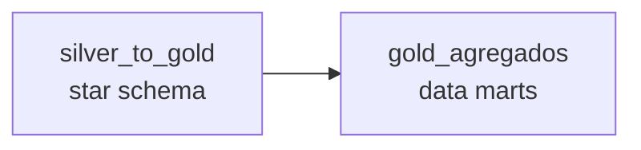

# Orquestracao — Apache Airflow

DAGs que orquestram a pipeline do data lake medalhao.

| DAG | Arquivo | O que faz |
|---|---|---|
| `gold_pipeline` | `gold_pipeline_dag.py` | Encadeia os dois estagios da Gold: `silver_to_gold` → `gold_agregados` |

## Como o Airflow executa os jobs

A imagem do Airflow (`docker/airflow/Dockerfile`) ja traz **Java + PySpark + Delta**,
e o compose monta o projeto em **`/opt/project/src`** com `PYTHONPATH` apontando para
la. Cada task executa o script Python correspondente **dentro do proprio container do
Airflow**:

```
python /opt/project/src/04_modelagem_gold/silver_to_gold.py
python /opt/project/src/04_modelagem_gold/gold_agregados.py
```

E o mesmo comando documentado para execucao manual — o Airflow so o encadeia, com
retries e dependencia (`silver_to_gold >> gold_agregados`). As credenciais do MinIO
vem do `.env` (`env_file`), entao `build_spark_session` (em `utils.spark_config`) as
encontra no ambiente. Os jars do Delta/s3a sao baixados sob demanda via
`spark.jars.packages` na primeira execucao.



## Pre-requisitos

- Rede Docker externa `datalake` criada: `docker network create datalake`.
- Stack principal no ar (MinIO): `docker compose -f docker/docker-compose.yml up -d`.
- **Silver populada** (rode `bronze_to_silver.py` antes; veja `src/03_transformacao/`).

## Subir o Airflow

A imagem do Airflow e customizada (`docker/airflow/Dockerfile`) para incluir
**Java, PySpark e Delta**, de modo que o proprio container roda o Spark.

```bash
docker compose -f docker/airflow/docker-compose.yml up -d --build
```

Acesse `http://localhost:8080` (admin / admin), ative a DAG **`gold_pipeline`** e
dispare (Trigger). A DAG nasce pausada (`DAGS_ARE_PAUSED_AT_CREATION=true`).

## Execucao manual (sem Airflow)

```bash
docker exec airflow_scheduler python /opt/project/src/04_modelagem_gold/silver_to_gold.py
docker exec airflow_scheduler python /opt/project/src/04_modelagem_gold/gold_agregados.py
```

Ou, alternativamente, dentro do container `jupyter_spark` (que tambem tem Spark):

```bash
docker exec jupyter_spark python /home/jovyan/work/src/04_modelagem_gold/silver_to_gold.py
```

## Proximos passos

`gold_pipeline` cobre apenas a Gold. Para a pipeline ponta a ponta, criar DAGs (ou
tasks) para `landing_to_bronze` → `bronze_to_silver` e encadear `gold_pipeline` em
seguida (ex.: via `TriggerDagRunOperator` ou um Dataset/agendamento comum).
