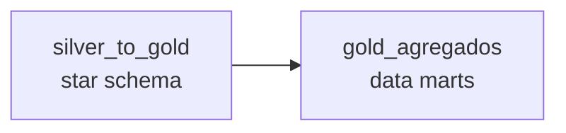

# Orquestracao — Apache Airflow

DAGs que orquestram a pipeline do data lake medalhao.

| DAG | Arquivo | O que faz |
|---|---|---|
| `gold_pipeline` | `gold_pipeline_dag.py` | Encadeia os dois estagios da Gold: `silver_to_gold` → `gold_agregados` |

## Como o Airflow executa os jobs

O Spark (PySpark + Delta + jars + acesso s3a ao MinIO) vive no container
**`jupyter_spark`**, com o projeto montado em `/home/jovyan/work`. A imagem do
Airflow **nao tem Spark** — ela apenas **orquestra**. Cada task dispara o script
Python correspondente **dentro do `jupyter_spark`** via `docker exec`:

```
docker exec jupyter_spark python /home/jovyan/work/src/04_modelagem_gold/silver_to_gold.py
docker exec jupyter_spark python /home/jovyan/work/src/04_modelagem_gold/gold_agregados.py
```

E o mesmo comando documentado para execucao manual — o Airflow so o encadeia, com
retries e dependencia (`silver_to_gold >> gold_agregados`). As credenciais do MinIO
ja estao no ambiente do `jupyter_spark` (carregadas do `.env`), entao o `exec` as
herda automaticamente.



## Pre-requisitos

- Rede Docker externa `datalake` criada: `docker network create datalake`.
- Stack principal no ar (MinIO + jupyter_spark): `docker compose -f docker/docker-compose.yml up -d`.
- **Silver populada** (rode `bronze_to_silver.py` antes; veja `src/03_transformacao/`).

## Subir o Airflow

A imagem do Airflow e customizada (`docker/airflow/Dockerfile`) para incluir o
**Docker CLI**, e o compose monta o **socket do Docker** do host para permitir o
`docker exec`.

```bash
docker compose -f docker/airflow/docker-compose.yml up -d --build
```

Acesse `http://localhost:8080` (admin / admin), ative a DAG **`gold_pipeline`** e
dispare (Trigger). A DAG nasce pausada (`DAGS_ARE_PAUSED_AT_CREATION=true`).

### Permissao do socket do Docker

O acesso ao `/var/run/docker.sock` exige que o usuario do Airflow esteja no grupo
dono do socket:

- **Docker Desktop (Windows/macOS)** — socket normalmente `root:root`; o
  `group_add: ["0"]` ja resolve. Nada a fazer.
- **Host Linux** — socket geralmente `root:docker`. Descubra o gid e exporte antes
  do `up`:

  ```bash
  export DOCKER_GID=$(getent group docker | cut -d: -f3)
  docker compose -f docker/airflow/docker-compose.yml up -d --build
  ```

## Execucao manual (sem Airflow)

```bash
docker exec jupyter_spark python /home/jovyan/work/src/04_modelagem_gold/silver_to_gold.py
docker exec jupyter_spark python /home/jovyan/work/src/04_modelagem_gold/gold_agregados.py
```

## Proximos passos

`gold_pipeline` cobre apenas a Gold. Para a pipeline ponta a ponta, criar DAGs (ou
tasks) para `landing_to_bronze` → `bronze_to_silver` e encadear `gold_pipeline` em
seguida (ex.: via `TriggerDagRunOperator` ou um Dataset/agendamento comum).
